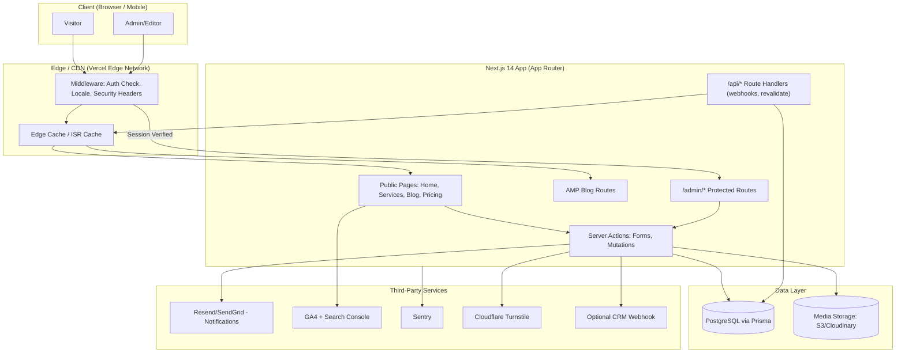
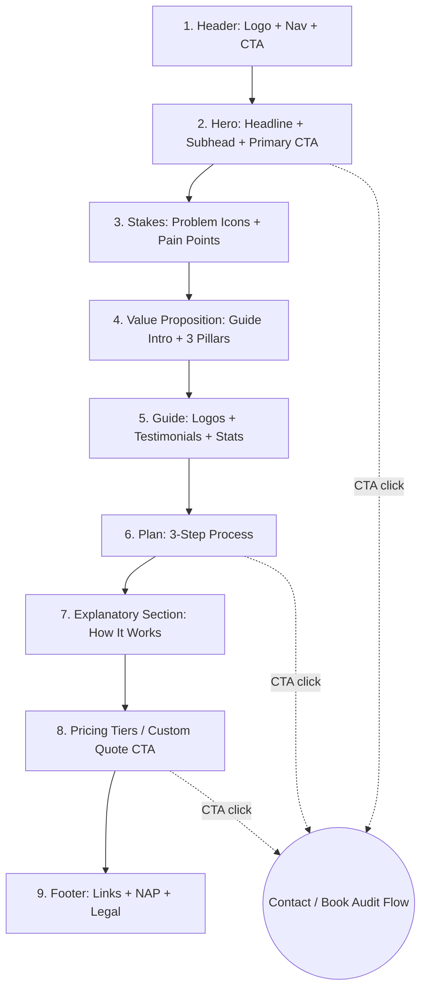
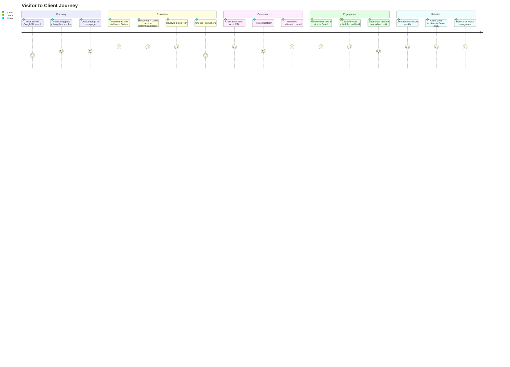
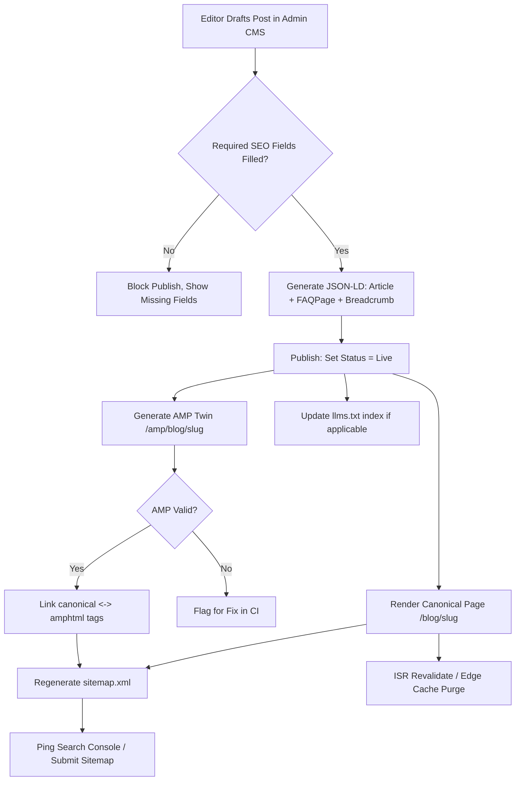
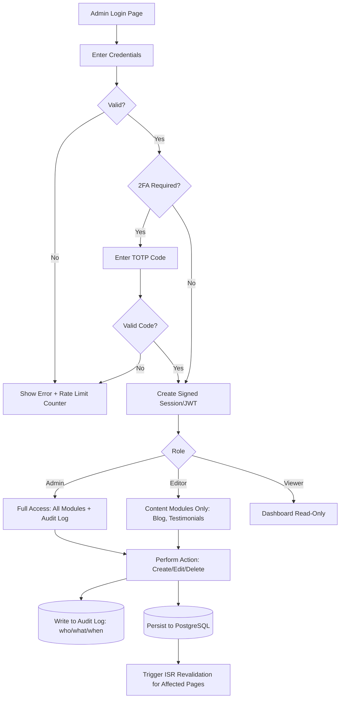
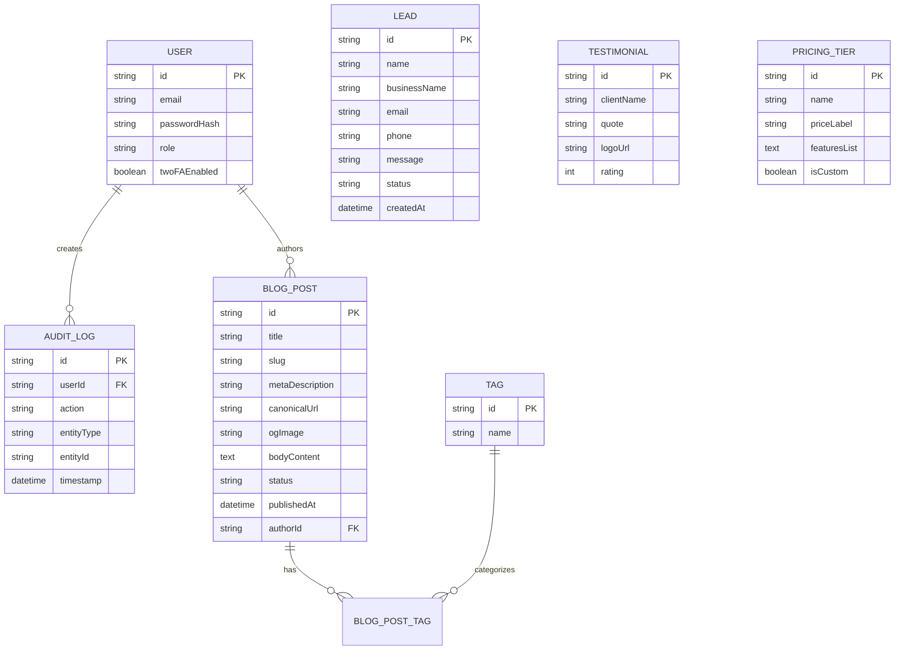
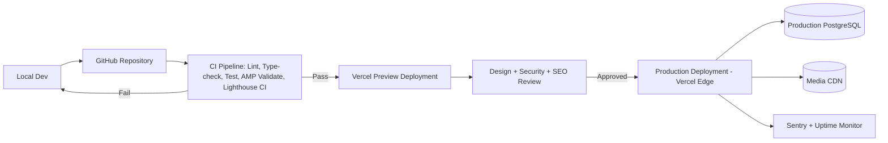

# Architecture.md — Gravity For AI (Diagrams, Flows, Journeys)

> Diagrams use Mermaid syntax — render in any Mermaid-compatible viewer (GitHub, Notion, VS Code extension, or the Mermaid Live Editor).

---

## 1. High-Level System Architecture

---

## 2. Homepage — 7-Step Framework Component Diagram

Each numbered block = one reusable React component (`<Header/>`, `<Hero/>`, `<Stakes/>`, `<ValueProposition/>`, `<GuideSection/>`, `<Plan/>`, `<Explainer/>`, `<Pricing/>`, `<Footer/>`), composed identically on service landing pages with content swapped via props/CMS data.

---

## 3. Visitor User Flow (Marketing Site → Lead)

```mermaid
flowchart LR
    A[Land on Site] --> B{Entry Point}
    B -->|Organic Search| C[Blog Post or Service Page]
    B -->|Direct/Referral| D[Homepage]
    B -->|AI Answer Engine Citation| C

    D --> E[Scroll Through 7-Step Framework]
    C --> F[Read Content + Internal Links]

    E --> G{Convinced?}
    F --> G

    G -->|Yes| H[Click Primary CTA: Book an AI Audit]
    G -->|Needs more info| I[Visit Pricing / Case Studies]
    I --> G

    H --> J[Contact/Booking Page]
    J --> K[Fill Form: Name, Business, Need]
    K --> L[CAPTCHA + Validation]
    L --> M[Server Action: Save Lead + Notify Team]
    M --> N[Confirmation Screen + Email]
    N --> O[Team Follow-Up within Admin Panel]
```

---

## 4. Lead-to-Client Journey Map

---

## 5. Blog Content Flow (SEO + AMP + GEO)

---

## 6. Admin Panel — Auth & Content Management Flow

---

## 7. Data Model (Entity Overview)

---

## 8. Deployment Architecture

---

## 9. Notes for Implementation

- All flows above map directly to the phases defined in `phases.md`.
- Every diagram's components correspond to modules/tables described in `product.md`.
- `memory.md` should log, for each implemented diagram/flow, the date completed, files touched, and any deviation from this architecture (with rationale).
